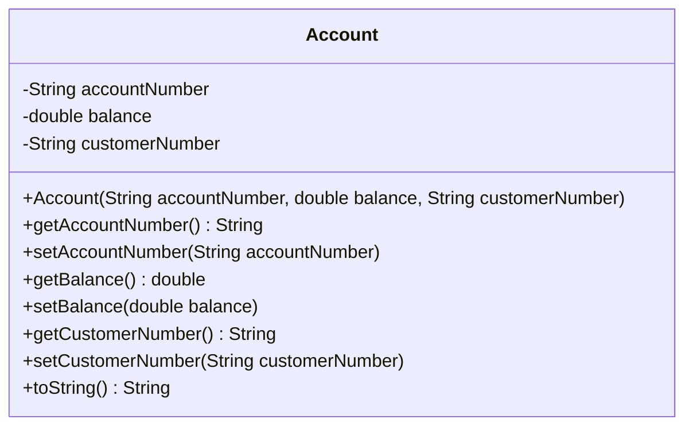
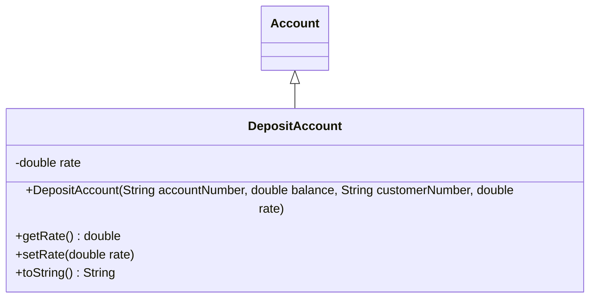
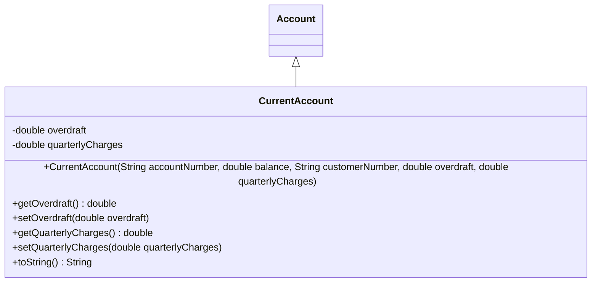
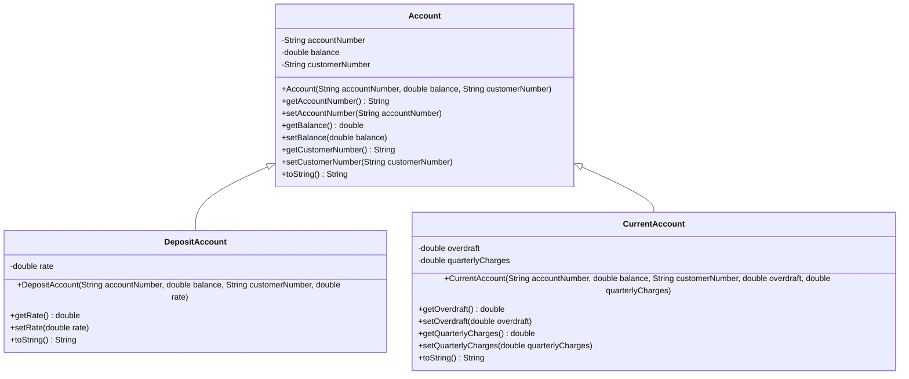

# Introduction to Object Oriented Programming – Quiz 1

**In-class Assessment – 10%**  

- **Date**: Wednesday October 9, 2024
- **Time**: 4 pm – 6 pm
- **Programme**: Computing – Mobile and Web
- **Year**: 2

## Instructions

1. Complete the Moodle Quiz online in the time allocated.
2. Create an exam folder on your desktop named `SDB`. This folder should contain your Visual Paradigm file and project code by the end of this exam.
3. Open Visual Paradigm and create a new blank project named `SDB`. Open IntelliJ and create a new project named `SDB`. You are **not allowed** to use inline code completion.
4. Complete Tasks 1 to 5.
5. Upload your compressed exam folder to Moodle before leaving the lab.

As a Java Software Developer at one of the biggest consulting firms in Ireland, you have been tasked to design and implement a software system for the Sustainable Development Bank to handle their account operations.

### Task 1

Draw a UML diagram for a class named `Account`. The class has 3 attributes: an `accountNumber`, a `balance`, and a `customerNumber`. Provide appropriate data types for all attributes. The class has a 3-arg constructor for all its attributes. It has Getter and Setter methods for all its attributes as well as a `toString()` method that returns the attributes and their values. Implement the `Account` class in Java.

**Note**: It does not have a default no-arg constructor.

### Answer 1



> Class diagram for the `Account` class.

```java
public class Account {
    private String accountNumber;
    private double balance;
    private String customerNumber;

    public Account(String accountNumber, double balance, String customerNumber) {
        this.accountNumber = accountNumber;
        this.balance = balance;
        this.customerNumber = customerNumber;
    }

    public String getAccountNumber() {
        return accountNumber;
    }

    public void setAccountNumber(String accountNumber) {
        this.accountNumber = accountNumber;
    }

    public double getBalance() {
        return balance;
    }

    public void setBalance(double balance) {
        this.balance = balance;
    }

    public String getCustomerNumber() {
        return customerNumber;
    }

    public void setCustomerNumber(String customerNumber) {
        this.customerNumber = customerNumber;
    }

    @Override
    public String toString() {
        return "Account{" +
                "accountNumber='" + accountNumber + '\'' +
                ", balance=" + balance +
                ", customerNumber='" + customerNumber + '\'' +
                '}';
    }
}
```

> Java implementation of the `Account` class.

### Task 2

Draw a UML diagram for a class named `DepositAccount` that extends (inherits from) the `Account` class. A `DepositAccount` has one additional attribute named `rate`. Provide appropriate data types for all attributes. The `rate` should be set to 0.2% i.e. 0.002 and is the same for all instances of the `DepositAccount` class. The `DepositAccount` class has a 3-arg constructor that accepts an account number, a customer number, and a balance. It also has a getter and setter method for `rate` and a `toString()` method that returns the label “Deposit Account:” followed by all its attributes including the inherited ones. Implement the `DepositAccount` class in Java. **Note**: Your UML diagram should show the relationship between the `DepositAccount` and the `Account` class.

### Answer 2



> Class diagram for the `DepositAccount` class.

```java
public class DepositAccount extends Account {
    private double rate;

    public DepositAccount(String accountNumber, double balance, String customerNumber, double rate) {
        super(accountNumber, balance, customerNumber);
        this.rate = rate;
    }

    public double getRate() {
        return rate;
    }

    public void setRate(double rate) {
        this.rate = rate;
    }

    @Override
    public String toString() {
        return "Deposit Account: " +
                "Account Number: " + getAccountNumber() +
                ", Balance: " + getBalance() +
                ", Customer Number: " + getCustomerNumber() +
                ", Rate: " + rate;
    }
}
```

> Java implementation of the `DepositAccount` class.

### Task 3

Draw a UML diagram for a class named `CurrentAccount` that inherits from the `Account` class. A `CurrentAccount` has two additional attributes, `overdraft` and `quarterlyCharges`. The `overdraft` is the amount the bank allows a customer to withdraw in excess of their balance. The `quarterlyCharges` is the service charge the bank charges every three months on a `CurrentAccount`. It is the same for all current accounts. It should be set to €3.50. Provide appropriate data types for all attributes. A `CurrentAccount` class should have a 4-arg constructor that accepts the account number, customer number, balance, and overdraft. Provide getter and setter methods for the `overdraft` and `quarterlyCharges` attributes. The `CurrentAccount` class should provide a `toString()` that returns the label “Current Account:” followed by all its attributes included in the inherited ones. Implement the `CurrentAccount` class in Java. **Note**: Your UML diagram should show the relationship between the `Account` and the `CurrentAccount` class.

### Answer 3



> Class diagram for the `CurrentAccount` class.

```java
public class CurrentAccount extends Account {
    private double overdraft;
    private double quarterlyCharges;

    public CurrentAccount(String accountNumber, double balance, String customerNumber, double overdraft, double quarterlyCharges) {
        super(accountNumber, balance, customerNumber);
        this.overdraft = overdraft;
        this.quarterlyCharges = quarterlyCharges;
    }

    public double getOverdraft() {
        return overdraft;
    }

    public void setOverdraft(double overdraft) {
        this.overdraft = overdraft;
    }

    public double getQuarterlyCharges() {
        return quarterlyCharges;
    }

    public void setQuarterlyCharges(double quarterlyCharges) {
        this.quarterlyCharges = quarterlyCharges;
    }

    @Override
    public String toString() {
        return "Current Account: " +
                "Account Number: " + getAccountNumber() +
                ", Balance: " + getBalance() +
                ", Customer Number: " + getCustomerNumber() +
                ", Overdraft: " + overdraft +
                ", Quarterly Charges: " + quarterlyCharges;
    }
}
```

> Java implementation of the `CurrentAccount` class.

### Master UML Diagram



### Task 4

In your main class, create a `DepositAccount` object `a1` and a `CurrentAccount` object `a2` with the appropriate value properties.

**Note**: Ensure you provide the right data type so your code complies. Output the objects `a1` and `a2`.

```text
Deposit Account:
Account Number: 002455723
Balance: €245.34
Customer Number: CUS08457
Rate: 0.002
```

```text
CurrentAccount
Account Number: 005345832
Balance: €785.80
Customer Number: CUS58534
Overdraft: €12.50
Quarterly Charges: €3.50
```

---

### Answer 4

```java
public class Main {
    public static void main(String[] args) {
        DepositAccount a1 = new DepositAccount("002455723", 245.34, "CUS08457", 0.002);
        CurrentAccount a2 = new CurrentAccount("005345832", 785.80, "CUS58534", 12.50, 3.50);

        System.out.println(a1);
        System.out.println(a2);
    }
}
```

### Task 5

Add a new attribute in the `Account` class of the appropriate definition with which you can count the number of accounts created in your program. Modify your main method and print out the number of accounts that exist. The program should print out the label "Number of accounts:" followed by the number of accounts.

```text
Number of accounts: 2
```

### Answer 5

```java
public class Account {
    private static int numberOfAccounts = 0;

    // existing code...

    public Account(String accountNumber, double balance, String customerNumber) {
        // existing constructor code...
        numberOfAccounts++;
    }

    public static int getNumberOfAccounts() {
        return numberOfAccounts;
    }

    // existing methods...
}

public class Main {
    public static void main(String[] args) {
        DepositAccount a1 = new DepositAccount("002455723", 245.34, "CUS08457", 0.002);
        CurrentAccount a2 = new CurrentAccount("005345832", 785.80, "CUS58534", 12.50, 3.50);

        System.out.println(a1);
        System.out.println(a2);
        System.out.println("Number of accounts: " + Account.getNumberOfAccounts());
    }
}
```
